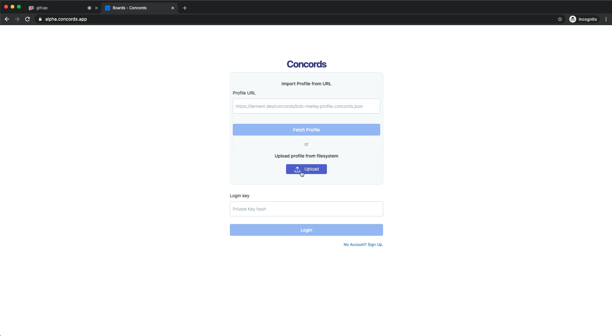
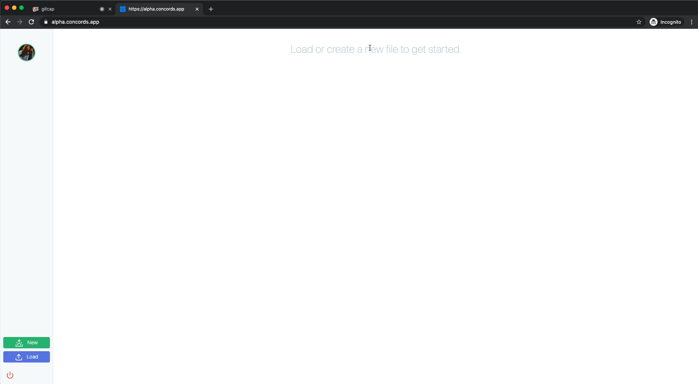
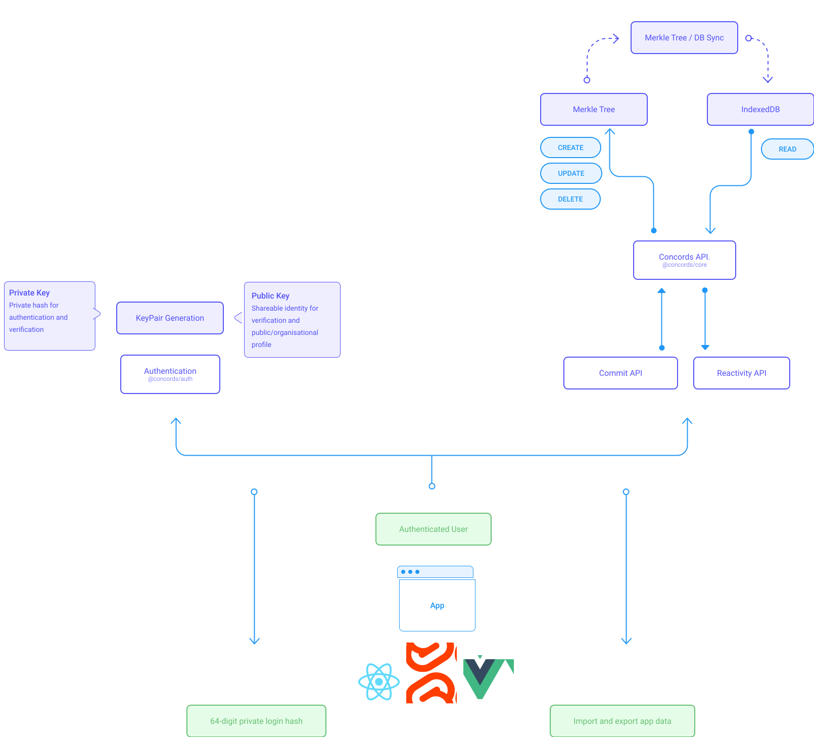

# What is Concords?

Concords is an MVP framework for building offline & decentralised web apps, with a file-based approach to storing data. It has no servers or databases and is a static app built with Javascript and HTML, all code is written to run in a browser and nothing is stored outside of the browser or downloaded files.

The full MVP is available to try at [alpha.concords.app](https://alpha.concords.app)

## Why?

SAAS applications run on servers with databases. Each interaction with the UI sends information from the browser to a server, which then likely writes something or fetches something from a centralized database.

Maintaining servers and databases is expensive, complex and time-consuming and I'm not really interested in that side of software. I don't want the responsibility to look after data that is depended upon, that's neither my skill-set nor passion. I like to focus my attention on the front-end experience.

I set out to build a framework for file-based SAAS apps. Multi-user collaborative apps, with data-driven user flows and advanced UI. But apps that run offline and save state to the filesystem, not send it off to a cloud-based database. Giving users full ownership and visibility of their data, with no dependency on an internet connection. Taking a progressive approach to connectivity, using it to enrich the experience, but not depend on it.

## Technical Steps

- Functional blockchain library in Typescript.

- [Svelte](https://svelte.dev/) & [Sapper](https://sapper.svelte.dev/) for all things UI.

- Blockchain sync with IndexedDB and reactivity hook.

- Created [some mini-apps](https://1.0.0.concords.app/) to refine and test the core functionality.

- User Authentication flow.

- [MVP: Kanban app](https://alpha.concords.app).


## Concords MVP: Board App

This MVP serves to demonstrate a basic solution to a truly offline and decentralized experience in a collaborative web app.
It's a static app, so just Javascript and HTML, with no servers or databases running in the background. It's a progressive web app with a service worker, that runs entirely in the browser. So once the initial load has been performed, the rest of the experience can work completely offline, where data is stored in files, downloaded and uploaded through the UI.

A boards app covers a lot of functionality commonly found in SAAS applications, I figured it's a great benchmark to prove out the technology.



---

### Authentication

With Concords, authentication is all done in the browser, without any communication to a server or external resource.

In the Concords authentication system, we issue a downloadable public profile which includes your public key and some basic user info. I keep mine for the MVP on my personal domain. https://ternent.dev/concords/sam-ternent.profile.concords.json

Anyone with access to my public key is able to encrypt data for me, that only I can read with my private key. I just have that stored on my personal machine. It’s never been online and no-one else knows it.

This key is used to log the user into the app and only a valid key combination can login and access the software.

For my MVP, this is more than sufficient to complete and decent authentication flow. We can have a recognisable UX of profile/password combination to build a login system, whilst setting us up for an encrypted, multi-user, data flow.


---

I know it's a pain to ask users to store both parts of their encryption keys themselves. If the private key is lost, it's unrecoverable and so is any encrypted data to that key. But I couldn't compromise here, it has to be this way to keep things decentralized. But it's a problem that can be fixed through software, it doesn't have to be my software - we're decentralizing things here, but key management software will fix this problem.

### The App

Knowing roughly what I needed to build to prove out the concept, and having already implemented User Profile and the authentication flow, the key features I chose to implement were:

- Create new and multiple boards
- Downloadable app files
- Load any board, from any user
- Assign tasks to users
- Editable tasks
- Timestamped actions
- Drag to sort columns
- Draggable tasks across columns
- Soft delete tasks to the trash, with restore and remove
- Activity log with an immutable history of the board



---

#### Multiple Users

By default, a new user doesn't have edit access to a document. For the purpose of the MVP, we've got a "Join" button in the left-hand sidebar. Clicking this will add the user as an entry to the data store and unlock editing. This covers the concept enough for now, but we are able to achieve direct encryption with the public/private key authentication, so that's going to be an interesting avenue to explore further outside of the MVP context.


---

### Core Library
The core of the framework is written in Typescript. It's a collection of functional utilities which cover the data side of the application. It runs an internal blockchain for writing data, mapped with an IndexDB instance for reading.

#### Blockchain
At the heart of the library is the [Merkel Tree](https://hackernoon.com/merkle-tree-what-is-it-and-why-use-it-8m2a63xjd) solution. Our Merkle Tree (as used in Blockchain and git), is a functional library to act as a blockchain node, from a JSON object structure, in the browser.

Built on top of that is a CRUD API which the application will interface with. When an action is performed in the app, a timestamped transaction is created for the blockchain. Once commit, all pending transactions are then added to a block on the chain. Once a block has been added to the blockchain, the hash-based data structure ensures the integrity of the app state.

```json
{
 "type": "tasks",
 "action": "create",
 "data": {
   "title": "Task Name",
   "description": "Task Description",
   "completed": false,
   "due_date": "2020-11-02",
   "assigned_to": "a72e75a898db9247be59d1aaf9d4c54459e1d24faa43d9f5da0a5a9611a19eb",
   "column": "2bb6a2b737381377fd962b1bda0771d084abd3cab270648c78b7e06566e6b5",
   "id": "d2e25d4d6c77b34fbe87da5f387cf8c3bec25ffc76673e84bf76dbf2aa15754f",
   "timestamp": 1604144654690
 },
 "user": {
   "firstName": "Sam",
   "lastName": "Ternent",
   "avatarUrl": "https://ternent.dev/concords/avatar.jpeg",
   "organisation": "Team Concords",
   "id": "a72e75a898db9247be59d1aaf9d4c54459e1d24faa43d9f5da0a5a9611a19eb"
 },
 "signature": "NOT RELEASED"
}
```
---

#### Database

Sitting on the other side of the blockchain is the DB layer. When a transaction it accepted onto the blockchain, we parse the event and perform an operation on an IndexedDB instance in the browser. Transactions are recorded as they go in, so we don’t duplicate transactions and minimise the number of write operations to the database.

As long as we have the blockchain data object, we have a full picture of our app and data state. We can drop and recreate a database with complete accuracy, based on secured transactional history. This is a __read only__ layer.


---

#### Architecture Overview



---

## Next Steps

### Desktop App

A quick leap here is to build this out into a desktop app using electron. Little things like saving the hash to a keychain, directly reading and writing to the filesystem. I'm excited to try running the [DAT](https://dat.foundation) project to enable P2P connectivity to give a realtime collaborative experience.

### Intergrations

My primary goal is decentralization. I'm not against storing data on the cloud, I just want to be able to make my own choice as to where. The initial standout integration I want to try is with Dropbox, syncing a folder in your filesystem to dropbox will give us the ability to introduce the "push/pull" aspect found in git.

### Conflict resolution

I need to do further research around conflict resolution. I have the basics for a complete blockchain, which includes proof of work and consensus to ensure the validity of the underlying data structure, but it doesn't secure or handle in-app data conflicts. Visual diffs and conflicts are problems solved in various other applications, with plenty of research available. I'm not sure how it will look yet, but it should be a fun one to solve.

### User roles & permissions

Using our data structure user roles and permissions are achievable. With the use of application-level permission keys, we can encrypt the access key for a specific user. They will then have access to any data under that permission level.
